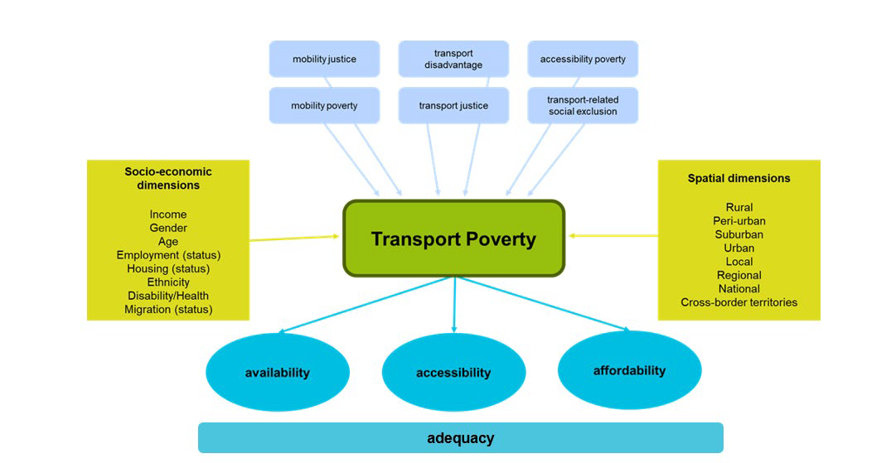
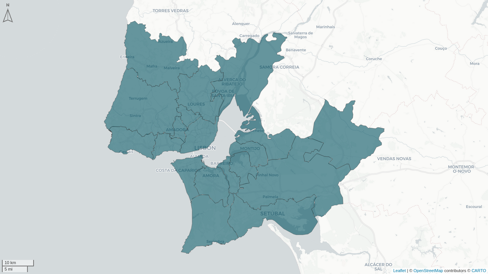
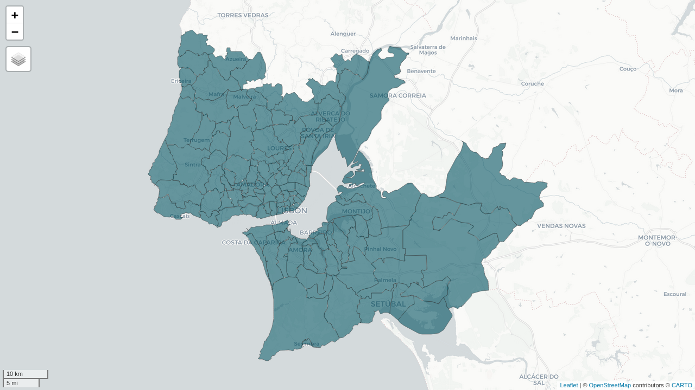
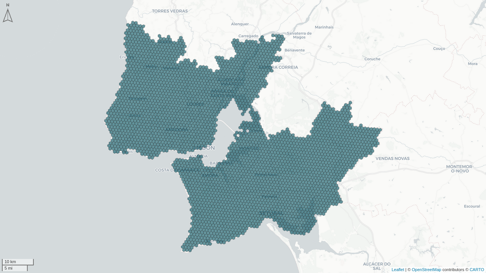
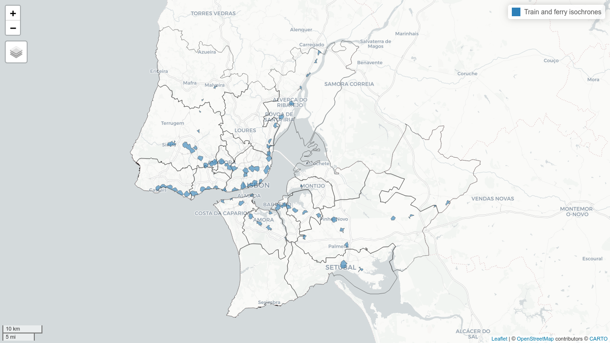
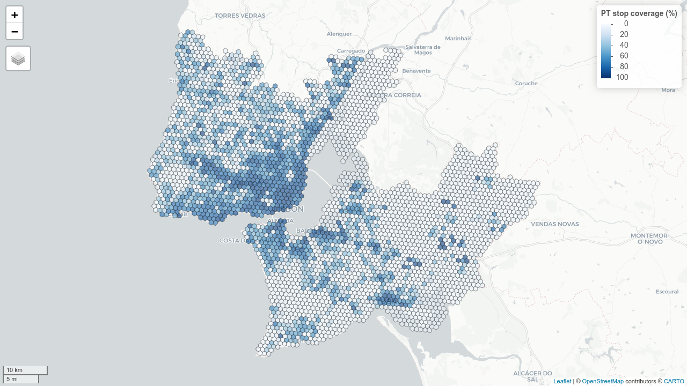
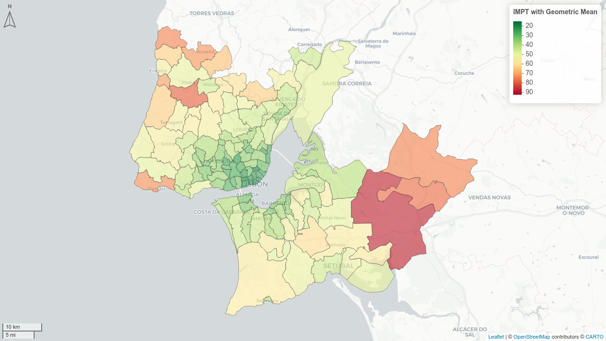
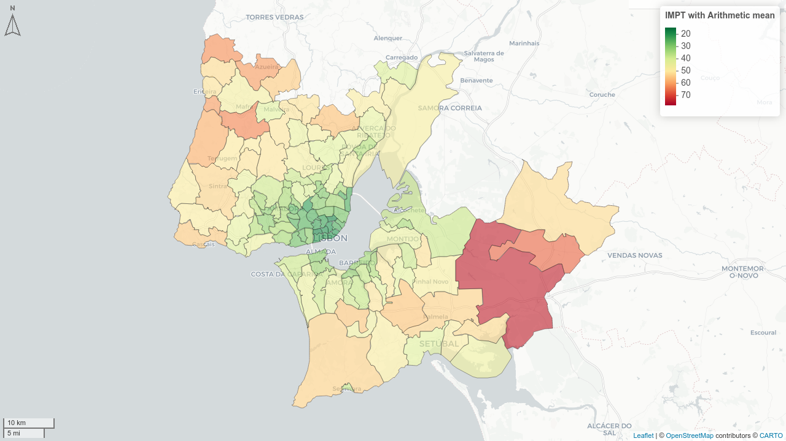
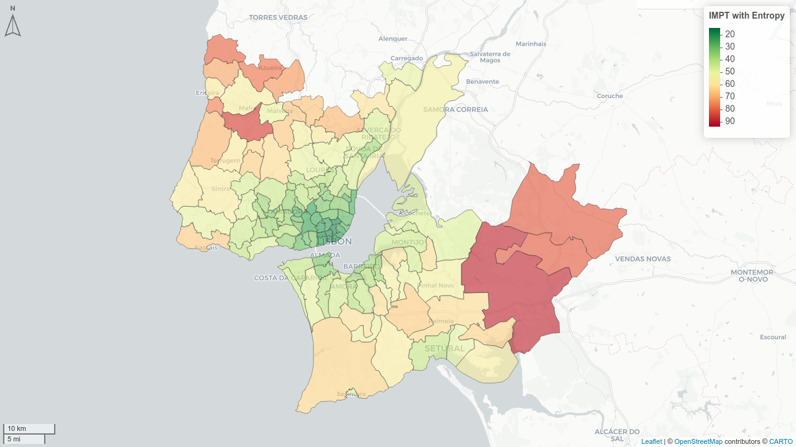
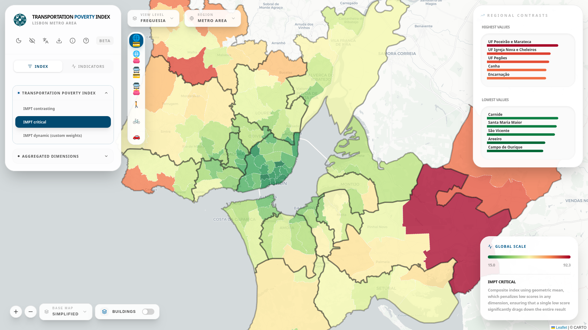

# Introduction {#sec-introduction}

Transportation is an essential service which can condition access to almost all human activities, be them work, education, health or social life. When this access is limited by insufficient supply, high costs, or elevated exposure to systemic risks and externalities, the term Transport Poverty is used [@Lucas_2016]. This phenomenon has direct consequences in social exclusion and territorial cohesion [@MejiaDorantes_MurauskaiteBull_2022].

In the European context, this problem has increased its political relevance over the last decade. The European Pillar of Social Rights, in its 20th Principle, enshrines the right to access essential services, including transportation. Regulation (EU) 2023/955 of 10 May 2023, which established the Social Climate Fund (SCF), enshrined the first legally bounding definition of transport poverty at an European scale, defining it as "individuals’ and households’ inability or difficulty to meet the costs of private or public transport, or their lack of or limited access to transport needed for their access to essential socioeconomic services and activities, taking into account the national and spatial context" [@EU_2023955] <!--# não tenho a certeza se esta citação está bem feita no .bib -->.

Despite the clear empirical relevance of this phenomenon, there is difficulty in quantifying it in a systematic way. Specifically in Portugal, previous research has focused on punctual case studies [@Pritchard_2014] or on costly mobility surveys [@INE_IMOB2017], which can hardly be renewed at the cadence required by public policy cycles.

This project was thus developed in an attempt to bridge the existing methodological gap with the creation of a composite and intermodal tool - the Multidimensional Transport Poverty Index (IMPT) - that is replicable and scalable, as well as wholly based in public data, intended to assist and support public policy instruments, such as the European Union's Social Climate Fund (SCF) or Sustainable Urban Mobility Plans (SUMPs). The Lisbon Metropolitan Area (LMA) was employed as a case study for the tool's validation.

# Literature review {#sec-literature_review}

## Definitions of Transport Poverty {#sec-LR_definitions}

Transport systems are a fundamental part of modern society, and their absence is related to social exclusion - a state where an individual or a societal group is left out of participating in regular social activities in a given society [@Pritchard_2014] -, socio-territorial inequality and transport inequality - the differences in transport conditions for different groups of people [@Hidayati_2021]. Despite the relation between poverty and transport conditions, these are also related to a wide range of social issues. As an example, motorized vehicle users contribute the most to externalities, but vulnerable road users are disproportionately affected by them in health, space allocation and time consumption [@Gossling_2016]. Moreover, lower-income households tend to not have financial conditions to have motorized transport or to reside in central areas, relegating them to live in areas distant from the city center, often poorly served by public transportation. [@Fedorowicz_2020] [@Lopes_2023].

These differences in transport conditions can lead to transport poverty, a concept which lacks a single universally accepted definition in scientific literature. This expression has been used to broadly describe inequities related with transportation access, but also in a more restricted way to refer to the economic inability to support transportation costs [@Mattioli_2018]. However, as @Lucas_2016 states, different terminologies relating to transport poverty - terms such as "mobility poverty", "accessibility poverty" or "transport disadvantage" - are used with "often very different, although also overlapping definitions". Due to this lack of a universal definition and the multidimensional nature of transport poverty, its measurement and quantification poses a challenge [@Levinson_King_2020].

This way, the necessity to comprehend this concept and quantify it becomes more urgent. It is essential to define reliable indicators of transport vulnerability to map "public transport deserts" [@Jiao_Dillivan_2013] and low-accessibility areas in order to inform public intervention and to monitor the implementation of measures to improve these situations. A reliable and replicable index to measure transport poverty is thus fundamental to support public policy instruments.

@Lucas_2016 proposes the most comprehensive conceptual systematization of transport poverty, clearly defining previously different but overlapping terminology. They define transport poverty as a combination of the following four dimensions:

- Accessibility - the capacity to reach usual destinations and activities (such as work, education or health).
- Mobility - the systemic aspects of the transportation system itself that impact essential trips, expressed in parameters such as public transport service frequency or average commuting time.
- Affordability - the ability of households to meet the cost of transportation.
- Exposure to externalities (Safety) - the negative effects of exposure to the transport system itself, such as environmental pollution or road crash rates.

Recently, and based on the aforementioned concepts, @MejiaDorantes_MurauskaiteBull_2022 have proposed a definition that has been widely adopted: transport poverty is the inability of an individual or household to access essential services or opportunities due to transportation services that are inaccessible, inadequate, unaffordable, time-consuming or unsafe. This definition has been adapted and applied at the European scale, through @EU_2023955 and a recent European Commission Report [@EuropeanCommission_2024]. The key dimensions in the EC Report are synthesized as *Availability* (corresponding to Lucas' Mobility), *Accessibility* and *Affordability*, with exposure to externalities being included in the overarching concept of *Adequacy* (@fig-transport_poverty_concept).

{#fig-transport_poverty_concept fig-align="center"}

In summary, the concept of transport poverty has evolved from a one-dimensional look at accessibility or affordability, to a composite approach that attempts to fully capture the multidimensional nature of this phenomenon.

## Dimensions of Transport Poverty {#sec-LR_dimensions}

The dimensions proposed by @Lucas_2016 continue to be the reference for composite indexes of transport poverty [@AlonsoEpelde_2023] [@MejiaDorantes_MurauskaiteBull_2022]. IMPT adopts these dimensions, implementing them through secondary data available in Portugal. Each dimension is further explained thoroughly.

### Accessibility {#sec-LR_accessibility}

Accessibility refers to the ability to reach regular destinations such as employment, education, health and other essential services [@Allen_Farber_2019] [@SocialExclusionUnit_2003]. The literature distinguishes between approaches based on cumulative opportunities - the number of reachable destinations within a certain travel time threshold -, gravity-based approaches, which continuously weight destinations based on impedance (i.e. the easier a destination is to reach, the more weight it will have) and hybrid approaches [@Geurs_vanWee_2004] [@Klar_2023]. @Pereira_Herszenhut_2023 formalize these methodologies in open-source software *R*, through the library `r5r`, which provides the technical base for the Accessibility dimension of the IMPT [@Pereira_r5r_2021].

### Mobility {#sec-LR_mobility}

Mobility refers to the systemic deficits of the transport system, be them lack of infrastructure, lack of service frequency or long trip duration [@Levinson_King_2020] [@Lucas_2016] [@MejiaDorantes_MurauskaiteBull_2022]. This dimension captures different aspects of transport supply that accessibility is not able to, their core difference being that, while accessibility asks which places are reachable, mobility focuses on how easy it is to reach them.

### Affordability {#sec-LR_affordability}

This dimension measures the capacity of households to support essential transportation expenses [@Isalou_2014] [@Litman_2026] [@Oviedo_2025]. The literature distinguishes three groups of indicators:

- The *10 percent rule*, which considers the households who spend more than 10% of their income in transportation, having been adopted in the United Kingdom, with its origins in the concept of "fuel poverty" [@Lucas_2016] [@AlonsoEpelde_2023].

- The *2M* approach, adapted from the concept of energy poverty, which considers the households that spend in transportation more than twice the national median [@AlonsoEpelde_2023].

- The combined approach of *housing and transportation affordability*, based on the premise that households make their residential location choice based on both housing and transportation costs. If the combined housing and transport cost doesn't exceed 45% of income, it is considered affordable [@Isalou_2014] [@Litman_2026].

The IMPT was rooted upon this last indicator, combining the costs of housing and transportation in relation to household income.

### Safety {#sec-LR_safety}

This dimension is commonly not included in transport poverty indexes [@Kelly_2023], being considered only in the most wide-ranging definitions of transport poverty [@Lucas_2016] [@UNHabitat_2013]. It refers to the exposure to externalities of the transport system, such as road crashes and pollution, which have disproportionate effects on the territory. For the IMPT, this dimension's inputs only included those related to road safety indicators, due to the inability to get open and granular data regarding environmental externalities.

A fifth dimension, digital literacy, was initially considered as a proxy for access to information and mobility services [@Durand_2022] [@OrozcoFontalvo_2025] [@Velaga_2012]. However, it was excluded from the final implementation of the index due to unavailability of data compatible with the scale of the lowest administrative division.

## Examples of geospatial tools of accessibility and equity

During the last decade various interactive spatial tools based on indicators of accessibility and inequality have been created and made publicly available. Two of these are here highlighted, due to their conceptual or methodological influence and their proximity to the IMPT's objective.

The project *Acesso a Oportunidades* (Access to Opportunities), developed by Instituto de Pesquisa Econômica (IPEA) under Rafael H. M. Pereira, provides accessibility estimates for the twenty biggest cities in Brazil, disaggregated in a hexagonal grid, by transport mode and type of opportunity. Its contribution is the creation of open R code, with the packages `r5r` and `accessibility`, which made the computation of multimodal travel time matrices possible [@Pereira_r5r_2021] [@Pereira_accessibility_2022] [@Pereira_Herszenhut_2023]. An interactive tool to visualize these results was also created, and is available at: <https://www.ipea.gov.br/acessooportunidades/mapa/>. IMPT directly incorporates this technical infrastructure in its Accessibility dimension, in order to compute the number of reachable opportunities by different travel modes and travel time thresholds, for each grid cell in the study area. Pereira's work is this way a critial operational pillar of the IMPT.

Another example is the *Atlas of Inequality*, developed by MIT Media Lab and Northwestern University, under the coordination of Esteban Moro. This project is originated from a different problem, and attempts to measure *segregation by experience*, i.e. how people of different socioeconomic levels share the same urban spaces in daily life, through anonymized cell phone location data. This indicator thus captures inequality in the use of the city, and not transport supply or access to destinations. It is available at: <https://inequality.media.mit.edu>.

However, the methodological distinction between *Acesso a Oportunidades*, *Atlas of Inequality* and the IMPT is significant. *Acesso a Oportunidades* is a tool for the measurement of accessibility, i.e. what is reachable from each location, under assumptions on transport supply, but not taking into account the quality of the transport service offered, the economic capacity of households or exposure to externalities. The *Atlas of Inequality*, is a tool to measure segregation, which is often revealed by mobility patterns. It captures the social dimension of urban inequality without diagnosing transport poverty itself, due to the exclusion of other variables of transport supply, exposure to externalities and costs. IMPT, on the other hand, is a multidimensional index to measure transport poverty, aggregating the dimensions of Accessibility, Mobility, Affordability and Safety in a composite index, in line with the operational definition provided by the European Union [@EU_2023955] [@EuropeanCommission_2024] and supported by the literature [@Lucas_2016] [@MejiaDorantes_MurauskaiteBull_2022].

## IMPT's Contribution {#sec-LR_contribution}

IMPT emerges in an attempt to create an index synthesizing these dimensions and providing a reliable measurement of transport poverty, bridging three gaps in the literature and in national public policy.

1.  There is, in Portugal, the absence of an index that integrates the four aforementioned dimensions across multiple transport modes and is replicable at the lowest administrative level.
2.  Existing indexes excessively depend on costly primary data that is difficult to monitor continuously. IMPT relies exclusively on secondary and open data, easily allowing for updates and monitoring over time.
3.  There is a lack of operational tools that allow to translate academic literature on transport poverty into decision-support instruments for local governments, transport authorities, and generally public policy makers.

Furthermore, the IMPT incorporates four methodological variants, corresponding to different analytical positions:

- **Contrasting IMPT:** based on entropy, it highlights the variables with the highest variation, better capturing territorial contrasts.
- **Critical IMPT:** based on the geometric mean, it non-linearly penalizes the dimension with the worst performance in each geographical unit.
- **Balanced IMPT:** based on the arithmetic mean, it allows for compensation between dimensions.
- **Political IMPT:** allowing for a personalized Analytic Hierarchical Process (AHP) weighting, it can be tailored to the decision-maker's preferences and priorities.

# Methodology {#sec-methodology}

Based on the guidelines provided by the OECD Handbook [@OECD_EU_2008], the IMPT was computed through the following procedural steps: (1) data collection, computation and normalization of every indicator; (2) aggregation of indicators per dimension through a Principal Component Analysis (PCA), and normalization of each dimension; (3) multidimensional aggregation of the four dimensions, employing three distinct methods; (4) results validation, through a workshop with representatives of municipalities within the Lisbon Metropolitan Area (LMA).

<!--# falta adicionar flowcharts-->

## Case Study {#sec-MET_case_study}

The Lisbon Metropolitan Area (LMA) was applied as the case study for the IMPT. The LMA is comprised of two NUTS II regions (Grande Lisboa and Península de Setúbal), which encompasses 18 Municipalities and approximately 2,8 million inhabitants. This region presents territorial characteristics which make it particularly suitable for this analysis: a polycentric structure with a strong employment center in Lisbon, significant discrepancies between the public transport offer in the urban core and in the periphery, and a high modal share of private vehicles in a large part of the metropolitan area.

The analysis is focused on the lowest administrative division, the *freguesia* (parish), which is the most disaggregated geographical level that guarantees data coverage for all utilized sources. For the indicators that had a higher level of granularity, an analysis by grid level (see @fig-lma_grid) was also assembled. The parish results were also aggregated by *município* (municipality), the administrative level immediately above the parish. The LMA contains 18 municipalities and 124 parishes (@fig-lma_units), which constitute the observation units of the IMPT.

::: {#fig-lma_units layout="[[1,1,1]]"}
{#fig-lma_mun}

{#fig-lma_parish}

{#fig-lma_grid}

Geographical units used in the IMPT
:::

## Data Sources {#sec-MET_data_sources}

Based on the literature, a preliminary list of indicators for each dimension was compiled, followed by an extensive search for public data to obtain the most possible of these indicators. However, some of them were either not found or not publicly accessible. This way, the final list of indicators included is shown in @tbl-all_indicators. This excludes indicators such as exposure to air pollution, overcrowding of public transportation, or walkability, as well as the dimension of digital literacy. The list of data sources used is shown in @tbl-data_sources.

::: {#tbl-all_indicators}
| Dimension     | Indicator                                            |
|---------------|------------------------------------------------------|
| Accessibility | Number of opportunities within travel time threshold |
| Accessibility | Travel time to first n opportunities                 |
| Mobility      | Average commuting time                               |
| Mobility      | Average number of commuting transfers                |
| Mobility      | Public transport headways and waiting times          |
| Mobility      | Public transport population coverage                 |
| Mobility      | Ratio of pedestrian and cycling infrastructure       |
| Mobility      | Shared mobility availability                         |
| Affordability | Transportation costs                                 |
| Affordability | Housing and transportation costs                     |
| Safety        | Aggregation of road safety indicators                |

Indicators used in the IMPT
:::

::: {#tbl-data_sources}
+----------------+----------------------------------------------------------------+----------------+-------------------------------------------------------------------------------------------------------------+
| Code           | Database                                                       | Year           | Source                                                                                                      |
+================+================================================================+================+=============================================================================================================+
| CAOP           | CAOP 2024.1 - Administrative Boundaries                        | 2024           | <https://www.dgterritorio.gov.pt/sites/default/files/ficheiros-cartografia/CAOP_Continente_2024.1-gpkg.zip> |
+----------------+----------------------------------------------------------------+----------------+-------------------------------------------------------------------------------------------------------------+
| BGRI21         | Census 2021 - Base Reference Geographical Information          | 2021           | <https://mapas.ine.pt/download/filesGPG/2021/nuts3/BGRI21_170.zip>                                          |
+----------------+----------------------------------------------------------------+----------------+-------------------------------------------------------------------------------------------------------------+
| IMOB           | IMOB 2017/18 - Inquérito à Mobilidade nas Áreas Metropolitanas | 2018           | <https://www.ine.pt/xurl/pub/349495406>                                                                     |
+----------------+----------------------------------------------------------------+----------------+-------------------------------------------------------------------------------------------------------------+
| GTFS           | GTFS — General Transit Feed Specification                      | 2026-02        | All LMA public transport operators (see @tbl-gtfs_sources)                                                  |
+----------------+----------------------------------------------------------------+----------------+-------------------------------------------------------------------------------------------------------------+
| OSM-RN         | OpenStreetMap (OSM) — Road network                             | 2026-01        | <https://export.hotosm.org/exports/4782f0b8-6778-4c0e-8e4f-97fc62e7f240>                                    |
+----------------+----------------------------------------------------------------+----------------+-------------------------------------------------------------------------------------------------------------+
| OSM-POI        | OpenStreetMap (OSM) — Points of interest                       | 2024-04        | <https://github.com/U-Shift/SiteSelection/releases/download/0.1/osm_poi_landuse.gpkg>                       |
+----------------+----------------------------------------------------------------+----------------+-------------------------------------------------------------------------------------------------------------+
| CM             | Carris Metropolitana — Health centres and schools datasets     | 2025           | <https://github.com/carrismetropolitana/datasets>                                                           |
+----------------+----------------------------------------------------------------+----------------+-------------------------------------------------------------------------------------------------------------+
| ASNR           | ANSR — Road accident data (location and type)                  | 2019-2023      | <https://pmmus.tmlmobilidade.pt/>                                                                           |
+----------------+----------------------------------------------------------------+----------------+-------------------------------------------------------------------------------------------------------------+
| INE-Inc        | INE — Household income by parish                               | 2023           | <https://www.ine.pt/xurl/pub/66303599>                                                                      |
+----------------+----------------------------------------------------------------+----------------+-------------------------------------------------------------------------------------------------------------+
| INE-Hous       | INE — Housing costs by parish                                  | 2021           | <https://www.ine.pt/xurl/pub/65586079>                                                                      |
+----------------+----------------------------------------------------------------+----------------+-------------------------------------------------------------------------------------------------------------+
| GBA            | Global Building Atlas - Building heights                       | 2026           | <https://github.com/zhu-xlab/GlobalBuildingAtlas>                                                           |
+----------------+----------------------------------------------------------------+----------------+-------------------------------------------------------------------------------------------------------------+
| PMMUS          | TML PMMUS - Shared mobility docks                              | 2025           | <https://pmmus.tmlmobilidade.pt/>                                                                           |
+----------------+----------------------------------------------------------------+----------------+-------------------------------------------------------------------------------------------------------------+
| COS            | COS 2023 v1 — Land use map                                     | 2023           | <https://geo2.dgterritorio.gov.pt/cos/S2/COS2023/COS2023v1-S2-gpkg.zip>                                     |
+----------------+----------------------------------------------------------------+----------------+-------------------------------------------------------------------------------------------------------------+
| IP             | Infraestruturas de Portugal — Toll costs                       | 2026           | <https://portagens.infraestruturasdeportugal.pt>                                                            |
+----------------+----------------------------------------------------------------+----------------+-------------------------------------------------------------------------------------------------------------+

Data sources used
:::

GTFS data sources for all LMA operators are presented in @tbl-gtfs_sources. This data includes public transport frequency, stop location and travel times, among other essential data to enable the estimation of Mobility and Accessibility metrics.

::: {#tbl-gtfs_sources}
+------------------------------------------+-----------------------+----------------------------------------------------------------------------------------+
| Operator                                 | Mode                  | GTFS URL                                                                               |
+==========================================+=======================+========================================================================================+
| Carris Metropolitana (CM)                | Bus                   | <https://api.carrismetropolitana.pt/gtfs>                                              |
+------------------------------------------+-----------------------+----------------------------------------------------------------------------------------+
| Carris                                   | Bus                   | <https://gateway.carris.pt/gateway/gtfs/api/v2.8/GTFS>                                 |
+------------------------------------------+-----------------------+----------------------------------------------------------------------------------------+
| MobiCascais                              | Bus                   | <https://drive.google.com/u/0/uc?id=13ucYiAJRtu-gXsLa02qKJrGOgDjbnUWX&export=download> |
+------------------------------------------+-----------------------+----------------------------------------------------------------------------------------+
| Transportes Colectivos do Barreiro (TCB) | Bus                   | <https://backend.tcbarreiro.pt/download-gtfs>                                          |
+------------------------------------------+-----------------------+----------------------------------------------------------------------------------------+
| Metropolitano de Lisboa (ML)             | Metro                 | <https://metrolisboa.pt/google_transit/googleTransit.zip>                              |
+------------------------------------------+-----------------------+----------------------------------------------------------------------------------------+
| Comboios de Portugal (CP)                | Suburban rail         | <https://publico.cp.pt/gtfs/gtfs.zip>                                                  |
+------------------------------------------+-----------------------+----------------------------------------------------------------------------------------+
| Fertagus                                 | Suburban rail         | <https://mts.pt/imt/MTS-20240129.zip>                                                  |
+------------------------------------------+-----------------------+----------------------------------------------------------------------------------------+
| Metro Transportes do Sul (MTS)           | Light rail            | <https://fertagus.pt/GTFSTMLzip/Fertagus_GTFS.zip>                                     |
+------------------------------------------+-----------------------+----------------------------------------------------------------------------------------+
| Transtejo/Softlusa (TTSL)                | Ferry                 | <https://api.transtejo.pt/files/GTFS.zip>                                              |
+------------------------------------------+-----------------------+----------------------------------------------------------------------------------------+

GTFS sources for LMA public transport operators
:::

Lastly, the following R packages were utilized in the data processing and creation of both the index and its interactive dashboard: `readr, readxl, openxlsx, lubridate, dplyr, tidyr, stringr, tidyverse, sf, terra, mapview, stplanr, h3jsr, r5r, accessibility, odjitter, tidytransit, GTFShift, FactoMineR, assertthat, piggyback`.

## Each Dimension's Indicators {#sec-MET_indicators}

The IMPT is not only multidimensional, but also intermodal. In @tbl-modes_per_dimension, the dimensions used to compute the index for each mode are specified.

::: {#tbl-modes_per_dimension}
| Dimension     | Mode                                        |
|---------------|---------------------------------------------|
| Accessibility | Driving, Public Transport, Walking, Cycling |
| Mobility      | Driving, Public Transport, Walking, Cycling |
| Affordability | Driving, Public Transport                   |
| Safety        | Driving, Walking, Cycling                   |

Modes computed for each dimension of the IMPT
:::

### Accessibility {#sec-MET_accessibility}

The Accessibility dimension quantifies the capacity to reach key destinations within a given travel time threshold. The key destination categories, as well as their data sources, are summarized in @tbl-poi_categories.

::: {#tbl-poi_categories}
+------------------------------+-----------------+-------------------------------------+----------------------------------------------------------------------+
| Category                     | Identifier      | Source                              | Filter/Description                                                   |
+==============================+=================+=====================================+======================================================================+
| Healthcare (all)             | health          | CM                                  | All health centers                                                   |
+------------------------------+-----------------+-------------------------------------+----------------------------------------------------------------------+
| Hospitals                    | health_hospital | CM                                  | Name contains 'Hospital' or 'Centro de Medicina'                     |
+------------------------------+-----------------+-------------------------------------+----------------------------------------------------------------------+
| Primary care centers         | health_primary  | CM                                  | Name contains 'Centro de Saúde'                                      |
+------------------------------+-----------------+-------------------------------------+----------------------------------------------------------------------+
| Supermarket/groceries        | groceries       | OSM                                 | `type %in% c('supermarket','convenience')`                           |
+------------------------------+-----------------+-------------------------------------+----------------------------------------------------------------------+
| Green spaces                 | green_spaces    | OSM                                 | `group == 'leisure' & type %in% c('park','garden')`                  |
+------------------------------+-----------------+-------------------------------------+----------------------------------------------------------------------+
| Recreation                   | recreation      | OSM                                 | `type %in% c('library', 'theatre', 'cinema', 'restaurant', 'cafe',`\ |
|                              |                 |                                     | `'bar', 'pub', 'pitch', 'fitness_station',`\                         |
|                              |                 |                                     | `'swimming_pool', 'sports_centre', 'fitness_center')`                |
+------------------------------+-----------------+-------------------------------------+----------------------------------------------------------------------+
| Schools (all)                | schools         | CM                                  | All school types                                                     |
+------------------------------+-----------------+-------------------------------------+----------------------------------------------------------------------+
| Primary schools              | schools_primary | CM                                  | Primary education schools only                                       |
+------------------------------+-----------------+-------------------------------------+----------------------------------------------------------------------+
| Transit stops (all)          | transit         | GTFS (all operators)                | All transit stops from all operators                                 |
+------------------------------+-----------------+-------------------------------------+----------------------------------------------------------------------+
| Transit stops (bus)          | transit_bus     | GTFS (Carris, CM, MobiCascais, TCB) | Bus stops only                                                       |
+------------------------------+-----------------+-------------------------------------+----------------------------------------------------------------------+
| Transit stops (mass transit) | transit_mass    | GTFS (ML, CP, Fertagus, MTS, TTSL)  | Mass transit (metro, rail and ferry) stops only                      |
+------------------------------+-----------------+-------------------------------------+----------------------------------------------------------------------+
| Jobs                         | jobs            | IMOB                                | Jittered OD destinations (see @sec-MET_jittering)                    |
+------------------------------+-----------------+-------------------------------------+----------------------------------------------------------------------+

POI categories, sources and filters
:::

This dimension incorporates two metrics:

1.  Cumulative number of opportunities: number of points of interest of a given category reachable within a certain amount of time.
2.  Travel time to reach nearest opportunities: time required to reach the first *n* opportunities of a given category.

Indicators for this dimension were computed using the H3 grid [@Uber_H3_2018] of resolution 8 [@Pereira_accessibility_2022], which corresponds to 3686 hexagons in the LMA, with an edge length of 531 meters and an average hexagon area of approximately 737,327m².

#### Jittering {#sec-MET_jittering}

Due to a lack of open access to fine data regarding job location, the most granular data obtained was an OD matrix at the parish level, provided by @INE_IMOB2017, with centroid to centroid representations, "a common approach involving the simplifying assumption that all trip destinations and origins can be represented by (sometimes population weighted or aggregated) zone centroids" [@Lovelace_2022]. However, in order to accurately compute accessibility and mobility measures, there was the need to have more disaggregated data regarding job locations, beyond the parish unit.

This way, jittering [@Lovelace_2022] was used as a proxy for this purpose, using building volumes as trip attractors, and this way weighting origins (random samples from residential buildings) and destinations (buildings weighted by volume). This allowed for the disaggregation of trips between parishes to OD pairs with a maximum of 50 trips per OD, with ODs with more trips than this value are split into multiple point-to-point pairs, in order to provide further spatial resolution. The process generated approximately 18,500 jittered OD pairs that represent the daily commuting patterns of the LMA. This value was then expanded to the real number of trips using a weighting variable (*PESOFIN)* provided by @INE_IMOB2017.

#### Travel time matrix {#sec-MET_TTmatrix}

A travel time matrix was used as the basis for all accessibility measures. It was computed between each grid cell, over a network [@Pereira_r5r_2021] that was built considering:

- OpenStreetMap [@OpenStreetMap] road network, exported from @hot_osm.

- General Transit Feed Specification (GTFS) for all operators in the LMA (valid at 04/02/2026).

- Terrain elevation profile [@copernicus_browser].

The matrix was computed using the function `r5r::travel_time_matrix()` [@Pereira_Herszenhut_2023] with the parameters shown in @tbl-ttm_parameters.

::: {#tbl-ttm_parameters}
+-----------------------+---------------------------------------------------------------+-------------------------------------------------------------------------------------------------------------------------------------------------------+
| Modes                 | Parameter                                                     | Description                                                                                                                                           |
+=======================+===============================================================+=======================================================================================================================================================+
| All                   | `percentiles = 50`                                            | 50th percentile (median) travel time. It is used so results represent the median travel conditions and not the "best-case" or "worst-case" scenarios. |
+-----------------------+---------------------------------------------------------------+-------------------------------------------------------------------------------------------------------------------------------------------------------+
| All                   | `max_trip_duration = 120`                                     | Maximum trip duration, in minutes.                                                                                                                    |
+-----------------------+---------------------------------------------------------------+-------------------------------------------------------------------------------------------------------------------------------------------------------+
| Public transport      | `mode_egress=WALK`                                            | Mode used after egress from the last public transport.                                                                                                |
+-----------------------+---------------------------------------------------------------+-------------------------------------------------------------------------------------------------------------------------------------------------------+
| Public transport      | `max_walk_time = 15`                                          | Maximum walking time (in minutes) to access or egreess public transport, or to transfer inside the network.                                           |
+-----------------------+---------------------------------------------------------------+-------------------------------------------------------------------------------------------------------------------------------------------------------+
| Public transport      | `departure_datetime = 04/02/2026 at 08:00:00 AM`              | Departure date and time considered for public transport.                                                                                              |
+-----------------------+---------------------------------------------------------------+-------------------------------------------------------------------------------------------------------------------------------------------------------+
| Public transport      | `Max_rides = 2` (1 transfer) or `Max_rides = 3` (2 transfers) | Maximum number of public transport transfers allowed in the same trip.                                                                                |
+-----------------------+---------------------------------------------------------------+-------------------------------------------------------------------------------------------------------------------------------------------------------+
| Cycling               | `max_lts = 3`                                                 | Maximum level of stress tolerated by cyclists in a road environment.                                                                                  |
+-----------------------+---------------------------------------------------------------+-------------------------------------------------------------------------------------------------------------------------------------------------------+

Parameters used in the computation of the travel time matrix
:::

#### Cumulative number of opportunities {#sec-MET_Nopportunities}

The cumulative number of opportunities was calculated using the function `accessibility::cumulative_cutoff()` considering the travel time matrices for each grid cell combination, the number of opportunities per grid cell, and the travel time cut-offs.

This measure was computed for all combinations of POIs and modes for time cut-offs of 5, 10, 15, 30, 45, 60, 75 and 90 minutes. However, as can be seen in @tbl-accessibility_n_opportunities, only selected combinations of modes/points of interest were included in IMPT's operationalization.

::: {#tbl-accessibility_n_opportunities}
+-----------------------+-----------------------------+--------------------+
| Point of Interest     | Driving or Public Transport | Walking or Cycling |
+=======================+=============================+====================+
| Healthcare facilities | 30                          | 15                 |
+-----------------------+-----------------------------+--------------------+
| Basic education       | 30                          | 15                 |
+-----------------------+-----------------------------+--------------------+
| Green spaces          | 5-10                        | 15-30              |
+-----------------------+-----------------------------+--------------------+
| Recreation            | 5-10                        | 15-30              |
+-----------------------+-----------------------------+--------------------+
| Groceries             | 15                          | 15                 |
+-----------------------+-----------------------------+--------------------+
| Jobs                  | 30-45                       | 30-45              |
+-----------------------+-----------------------------+--------------------+

Travel time threshold (minutes) to compute cumulative number of opportunities
:::

The value computed represents the number of opportunities reachable within the defined travel time threshold. Values at parish and municipality level are aggregated considering a weighted mean of the number of opportunities reachable in each grid cell within that geographical unit, weighted by the population of those cells.

#### Travel time to reach closest opportunities {#sec-MET_TTopportunities}

This measure was computed using the function `accessibility::cost_to_closest()` [@Pereira_accessibility_2022] <!--# a citação do package de accessibility de Pereira 2022 não funciona (link não leva a lado nenhum) -->, considering the travel time matrices for each grid cell combination and the number of opportunities in each grid cell. Its output corresponds to the travel cost, in minutes, to reach *n* opportunities of a certain category. Although calculations were performed for 1, 2 and 3 opportunities, only some of these were included in IMPT's operationalization, depending on the POI category:

- Healthcare, basic education and green spaces: 1 opportunity.

- Recreation, groceries and jobs: 3 opportunities.

### Mobility {#sec-MET_mobility}

Mobility evaluates the quality of the transportation system as a service, independently of the accessibility of the destinations. The methodology to calculate its principal indicators is explained and detailed below.

#### Average commuting time

Using the jittered (see @sec-MET_jittering) OD pairs from @INE_IMOB2017 (for commuting) and the travel time matrices, average commuting travel times are computed for each geographical unit and mode, weighted by number of trips. Trips with no feasible route within the constraints are assigned the maximum travel time (120 min) and counted separately as “not accomplishable” trips (PNA - Percentagem Não Alcançáveis).

#### Average number of commuting transfers

For each commuting OD pair, the minimum number of transfers required for each public transport route (for 0, 1, 2, and 3 transfers) is assigned to each OD pair, and population-weighted mean transfers are computed per geographical unit. The result is the average minimum amount of transfers to commute to work using public transport.

#### Public transport headways and waiting times

Stop-level service frequencies were computed using `tidytransit::get_stop_frequency()` [@tidytransit] for four different time windows, as can be seen in @tbl-headway_periods.

::: {#tbl-headway_periods}
| Period           | Day                  | Time window |
|------------------|----------------------|-------------|
| Weekday peak     | Wednesday 04/02/2026 | 08:00-09:00 |
| Weekday full day | Wednesday 04/02/2026 | 00:00-48:00 |
| Weekday night    | Wednesday 04/02/2026 | 22:00-23:00 |
| Weekend          | Sunday 08/02/2026    | 10:00-11:00 |

Public transport service frequency periods observed
:::

A 500-meter buffer per stop is used to allocate stops to BGRI [@INE_Census2021] population centroids. Results are aggregated to geographical units as population-weighted mean headway and waiting time. Additionally, frequency reduction factors were computed to quantify the reduction in service during night and weekend periods. <!--# the methodology for PT population coverage wasn't used for this?? -->

#### Public transport population coverage

This indicator is estimated using walking isochrones around public transport stops (see @fig-pt_coverage_iso_train as an example), differentiated by transport mode and their typical service area. Isochrones are computed with the function `r5r::isochrone()` using the `WALK` mode and the AML street network. Three mode groups were defined based on stop type and catchment area, the rational being that high-density networks (e.g. buses) have a lower acceptable walking threshold, while mass transit networks with sparse stops (e.g. suburban railways) induce higher walking thresholds:

- Bus (Carris, CM, MobiCascais, TCB) - 5-minute walking threshold.

- Metro & light rail (ML, MTS) - 10-minute walking threshold.

- Train & Ferry (CP, Fertagus, TTSL) - 15-minute walking threshold.

To calculate resident population beyond the parish level, BGRI21-level population data [@INE_Census2021] was further disaggregated by residential density class through the intersection with COS [@COS_2023], in order to have the highest-possible resolution for residential locations. The residential density classes considered are shown in @tbl-cos_classes.

::: {#tbl-cos_classes}
+-----------------------------------------+-----------------------------------------+-----------------------+
| Class of residential area               | Translation                             | Weight                |
+=========================================+=========================================+=======================+
| Contínuas predominantemente verticais   | Continuous and predominantly vertical   | 3.0                   |
+-----------------------------------------+-----------------------------------------+-----------------------+
| Contínuas predominantemente horizontais | Continuous and predominantly horizontal | 1.0                   |
+-----------------------------------------+-----------------------------------------+-----------------------+
| Descontínuas                            | Discontinuous                           | 0.6                   |
+-----------------------------------------+-----------------------------------------+-----------------------+
| Descontínuas esparsas                   | Discontinuous and sparse                | 0.3                   |
+-----------------------------------------+-----------------------------------------+-----------------------+

Population and building density weights for COS land use classes
:::

Population data was then intersected with the public transport stop isochrones, and aggregated by geographical unit (see @fig-pt_coverage_all).

::: {#fig-pt_coverage layout="[[1,1]]"}
{#fig-pt_coverage_iso_train}

{#fig-pt_coverage_all}
:::

#### Ratio of pedestrian and cycling infrastructure

The pedestrian infrastructure ratio is the proportion of road length that includes pedestrian infrastructure, computed using [@OpenStreetMap] data:

$$R_{ped}=\frac{pedestrian\; path\; length}{road\; length}$$

Road classification uses the highway tags: `motorway, trunk, primary, secondary, tertiary, unclassified, residential, living_street`, as well as linked variants.

Pedestrian infrastructure classification uses the tags: `highway = footway | pedestrian | steps | residential` and `footway = sidewalk | crossing | path | platform | corridor | alley | track, and sidewalk = both | left | right`.

The calculation of cycling infrastructure ratio is analogous to the pedestrian ratio, and also extracted from @OpenStreetMap. Cycling infrastructure is further classified according to its type and level of segregation, according to the following description and OSM tags:

- Cycle track or lane (*Ciclovia segregada*): Segregated or light-separated tracks exclusive for cycling.

  - `highway = cycleway`

  - `highway = path` & `bicycle = designated`

  - `segregated = yes | no`

  - `cycleway` tags containing: `separate`, `buffered_lane`, `segregated`, `lane`, or `track`.

- Advisory lane (*Via partilhada com veículos motorizados / zonas 30*): Marked cycle lanes shared with motor vehicles, such as "sharrows" or advisory lanes.

  - `cycleway` tags containing: `shared_lane`.

- Protected Active (*Via partilhada com peões*): Infrastructure shared with pedestrians but protected from motor vehicles.

  - `highway = pedestrian` & `bicycle = designated`.

  - Refinement of `highway = path | footway | pedestrian` when `foot` access is explicitly allowed on cycling paths without physical segregation.

The primary indicators are thus:

- **Cycling infrastructure ratio:**

  $$R_{cyc}=\frac{total\; cycleway\; length}{road\; length}$$

- **Cycling quality ratio:**

  $$R_{ped}=\frac{segregated\; cycleway\; length}{total\; cycleway\; length}$$

Where “segregated cycleway length” corresponds to the "cycle track or lane" category.

#### Shared mobility availability

The number of shared mobility points (physical and virtual docks from all operators in the LMA [@pmmus]) was counted and aggregated per parish and per grid cell.

### Affordability {#sec-MET_affordability}

Affordability evaluates the capacity of households to support the monetary costs of transportation to access essential activities. IMPT uses a weighted cost by mode, in which the monetary cost of automobile/public transport travel is multiplied by each parish's modal share, and expressed as a proportion of median household income. The travel costs are estimated for one-way trips from home to the workplace during the morning peak.

#### Cost of driving {#sec-MET_cost_driving}

The cost of car travel is computed through:

$$ Cost_{car} = d \times 0.40€/km + Cost_{toll}$$

Where a fixed cost of 0.40€/km is used, based on @Portaria1553D2008, which sets mileage allowance to cover fuel and car maintenance. Tolls are computed through the toll calculator of Infraestruturas de Portugal [@ip_portagens], using the route geometry returned by `r5r::detailed_itineraries()`.

#### Cost of public transportation {#sec-MET_cost_PT}

To account for uncertainty in public transport fare payments, two scenarios were considered:

**Scenario A - Single ticket**

The average single ticket cost was calculated based on revenue data from Carris [@carris_contas_2024]:

- Total single ticket validations: 17,424,000

- Total single ticket revenue: 33,278,000€

- Average cost per single ticket: \~1.91€

This way, a single ticket cost of **1.91€** was assumed for all modes. Free transfers within the same mode for 60 minutes are assumed, but transfers to different modes incur an additional charge.

**Scenario B - Monthly pass (Navegante)**

Based on operator revenue data, the average cost of a monthly pass was estimated (@tbl-navegante).

::: {#tbl-navegante}
| Pass type               | Pass recharges | Pass price |
|-------------------------|----------------|------------|
| Navegante Metropolitano | 5,063,510      | 40€        |
| Navegante Municipal     | 887,190        | 30€        |
| Senior (+65)            | 1,103,782      | 20€        |
| Family                  | 243,784        | 80€        |
| Youth (sub-23)          | 3,425,013      | 0€         |

Revenue from Navegante monthly pass
:::

The average cost paid by a monthly pass holder is thus **\~25.25€**. Assuming an average of 44 monthly trips (2 trips in each of 22 working days), the average cost per trip becomes **\~0.57€**.

#### Composite indicators {#sec-MET_aff_composite}

Transport expenditure is expressed as a share of household income, with two variants (with and without housing costs). All costs are annualized and computed as yearly expenses per household (€/year/household). 250 days per year were considered, with two trips per day. Tolls are considered assymetrically for both directions, since the bridges' tolls are only paid one-way.

For driving:

$$ transp\_inc_{car} = \frac{C_{car}}{I_{household}} $$

$$ h\_transp\_inc_{car} = \frac{C_{car} + C_{housing}}{I_{household}} $$

To combine car and public transport costs, a composite indicator based on each parish's modal share from @census_2021_modal_share is computed:

$$ transp\_inc_{weighted} = \frac{C_{car} \cdot s_{car} + C_{PT} \cdot s_{PT}}{s_{car} + s_{PT} + s_{active}} $$

Where $s_m$ is the modal share of mode $m$. Active modes (walking and cycling) are included in the denominator to preserve the real modal structure of each parish, but are not included in the numerator, given their null direct cost. This option avoids overestimating the financial burden in parishes with a high active modal share, while reflecting the fact that a part of the population travels without a cost.

Driving costs are further adjusted for vehicle occupancy rate, household size and mobile population fraction [@INE_IMOB2017], to convert per-trip costs to a household-level annual burden. This way, the final average annual transport expenditure, accounting for all adjustments and modal shares, is computed as:

$$ transp\_inc\_comp = \frac{HH_{size} \cdot P_{mobile}}{I_{household}} \cdot \left[ \left( \frac{C_{car,day}}{O} \cdot \frac{s_{car}}{s_{car} + s_{PT} + s_{active}} \right) + (C_{PT,day} \cdot \frac{s_{PT}}{s_{car} + s_{PT} + s_{active}}) \right] \cdot N_{days} $$

<!--# esta equação sai do papel, como é que centro ou mudo de lugar? -->

Where:

- $N_{days}$ = 250 working days per year.

- $HH_{size}$ is the average household size.

- $P_{mobile}$ is the share of mobile population.

- $I_{household}$ is the average annual household income.

- $C_{car,day}$ and $C_{PT,day}$ are the round-trip costs for car and public transport.

- $O$ is the average vehicle occupancy rate.

- $s_{car}$, $s_{PT}$ and $s_{active}$ are the modal shares [@census_2021_modal_share].

For the variant that includes housing costs ($h\_transp\_inc\_comp$), the annualized housing cost $C_{\text{housing,year}}$[@census_2021_housing] is added to the numerator.

<!--# é preciso a parte que está no report metodológico com income, coeficiente gini e ratio de palma? -->

### Safety {#sec-MET_safety}

This dimension encompasses the disproportional exposure to externalities of the transportation system. It is entirely based on road safety data provided by Autoridade Nacional de Segurança Rodoviária (ASNR) through Transportes Metropolitanos de Lisboa (TML) [@pmmus]. It is important to note that only road crashes occuring *inside localities* (dentro das localidades), a category specified by the ASNR itself, are included in the index. In particular, this excludes crashes on motorways and on the two bridges crossing the Tagus river, while maintaining IMPT's spatial scope.

The indicators calculated for each geographical unit and transport mode are systematized below:

- **Total accidents (5 years):** $$\sum(Acc_{5y})$$
- **Fatalities (30-day):** $$\sum(VM_{30d})$$
- **Serious injuries (30-day):** $$\sum(FG_{30d})$$
- **Slight injuries (30-day):** $$\sum(FL_{30d})$$
- **Accident rate:** $$\frac{\sum(Acc_{5y})}{Population} \times 1000$$
- **Fatality rate:** $$\frac{\sum(VM_{30d})}{Population} \times 1000$$
- **Severity index (total):** $$\frac{\sum(VM_{30d})}{\sum(Acc_{5y})}$$
- **Severity index (motorized):** $$\frac{\sum(VM_{30d})}{Motorized\; vehicles\; involved}$$
- **Severity index (cycling):** $$\frac{\sum(VM_{30d})}{Cyclists\; involved}$$
- **Severity index (pedestrian):** $$\frac{\sum(VM_{30d})}{Pedestrians\; involved}$$

## Normalization and Aggregation {#sec-MET_normalisation_aggregation}

All indicators were normalized to the range \[1, 100\] using min-max scaling:

For benefit indicators (higher raw value → better): $$X_{norm} = 1 + \frac{X - X_{min}}{X_{max} - X_{min}} \times 99$$

For cost indicators (lower raw value → better): $$X_{norm} = 1 + \frac{X_{max} - X}{X_{max} - X_{min}} \times 99$$

- **Accessibility** metrics (`access_*`) are *benefit* indicators.
- **Mobility** cost metrics (`mobility_cost_*`), public transport waiting times, all **Affordability** indicators, and all **Safety** indicators are *cost* indicators.

Missing values in accessibility indicators (arising from unfeasible public transportation routes) are imputed with the mean of the respective variable prior to PCA.

## PCA-Based Dimension Scores {#sec-MET_pca}

For every dimension with multiple indicators (Accessibility, Mobility and Safety) and at the global (all-mode) and per-mode levels, a PCA is run using `FactoMineR::PCA()` at parish level.

In line with @OECD_EU_2008, the first principal component (PC1) score is used as the dimension index after rescaling to \[1, 100\]. PC1 captures the dominant axis of variation among the normalised indicators.

For the Affordability dimension, a PCA is not applied, due to there being too few indicators. Instead, the normalized composite `h_transp_inc_comp` (housing + transport cost as share of income, modal-share weighted) is used directly as the Affordability Index.

For Safety per mode, an equal-weight average of the severity index (per mode) and total vehicles involved (per mode) is used instead of PCA.

For Mobility - Car, a PCA is not applied, also due to there being too few indicators. Instead, we assumed an equal-weight average of the normalized composite `mobility_commuting_avg_tt_car` and `road_length`.

## Composite IMPT Scores {#sec-MET_composite_impt}

Three aggregation methods are computed for the global IMPT and each per-mode IMPT:

1.  **Critical IMPT - geometric mean** (equal weights, @fig-impt_geometric): $$IMPT_{geom} = \left(\prod_{d} (S_d + 1)\right)^{1/n} - 1$$

Partially compensatory: penalizes dimensions with very low values non-linearly. Highlights the most critical situations, where at least one dimension is severely deficient.

2.  **Balanced IMPT - arithmetic mean** (equal weights, @fig-impt_arithmetic): $$IMPT_{avg} = \frac{1}{n} \sum_d S_d$$

Compensatory: high vulnerability in one dimension can be offset by good performance in others. Suitable for setting aggregate policy targets and communicating to non-specialist audiences.

3.  **Contrasting IMPT - entropy-weighted geometric mean** (@fig-impt_entropy): $$IMPT_{entropy} = \prod_d (S_d + 1)^{w_d} - 1$$

where weights $w_d$ are derived from the **entropy weighting method**:

Weights are determined by the empirical dispersion of the dimensions across parishes: the dimension that varies most among territories receives greater weight. Maximizes territorial contrast and is useful for competitive prioritization of interventions.

$$w_d = \frac{d_d}{\sum_j d_j}, \quad d_d = 1 - e_d, \quad e_d = -k \sum_i p_{id} \ln(p_{id})$$

with $k = 1/\ln(n)$ and $p_{id}$ being the proportion of the dimension score for area $i$.

::: {#fig-impt_results layout="[[1,1,1]]"}
{#fig-impt_geometric}

{#fig-impt_arithmetic}

{#fig-impt_entropy}

IMPT results for different aggregation methods for all modes (with Navegante)
:::

## Validation

Finally, a workshop was carried out with LMA municipalities. It took place on April 9th, 2026 in the offices of Transportes Metropolitanos de Lisboa (TML), with the objectives of not only presenting and validating the results with municipality technicians, but also confronting the computed data with the local perception of the participants, in order to identify relevant divergences. It included representatives from 13 out of the 18 municipaities in the LMA, as well as representatives from transport authorities and operators.

<!--# acabar -->

<!--# falo do workshop aqui ou nos resultados? -->

# Results {#sec-results}

The full results of the IMPT for all LMA parishes are available in the dashboard (@fig-dashboard) created in the scope of this project. This dashboard allows for the visualization of the global indices (critical, balanced and contrasting), the results of each dimension by transport mode, all indicators that make up the index, as well as key statistics and summaries for various scales (parish, municipality and grid). Beyond results visualization, this tool allows for the calculation of the aggregated index adjusted to user preferences (political IMPT). For this purpose, an Analytic Hierarchical Process (AHP), that compares the user's preferences between dimensions and this way assigns weights to each, is made available to the dashboard's users. The dashboard is available at: <https://ushift.tecnico.ulisboa.pt/apps/impt>.

::: {#fig-dashboard layout="[[1]]"}

IMPT Dashboard
:::

It is worth noting that the IMPT is a relative index, created with the purpose of comparing different areas in the same metropolitan area, not of being an absolute index of transport poverty. This way, a global score of 0 (resp. 100) should not be interpreted as the "best" (resp. "worst") possible outcome.

## Methodological comparison

From @tbl-results_impt_contrasting, it can be seen that the five parishes with the lowest contrasting IMPT form a contiguous cluster in the center of Lisbon. These areas benefit simultaneously from high Accessibility and Mobility (being located in the urban core, they have very good access to opportunities and quality public transport service and active modes infrastructure) and relatively low road accident rates (high Safety). Although these parishes also score very high in the Affordability dimension, it is worth noting that this score also stems from the high median income in this region, and is not only due to low transportation costs.

Meanwhile, the parishes which score the highest in the IMPT are predominantly located in rural regions in the east and northwest, far from the urban core, namely in the municipalities of Montijo and Mafra. These parishes tend to score very poorly in every dimension apart from Safety, which is oftentimes even higher than the LMA average. The concentration of the worst-scoring parishes in specific areas of the LMA suggest that integrated intervention strategies, at the municipal level or higher, can be more effective than parish-by-parish interventions.

::: {#tbl-results_impt_contrasting}
+-------------+------------------------------------------------+------------------+
| Ranking     | Parish                                         | Contrasting IMPT |
+=============+================================================+==================+
| 1           | Arroios                                        | 13.4             |
+-------------+------------------------------------------------+------------------+
| 2           | Areeiro                                        | 14.9             |
+-------------+------------------------------------------------+------------------+
| 3           | Campo de Ourique                               | 15.0             |
+-------------+------------------------------------------------+------------------+
| 4           | Santo António                                  | 15.3             |
+-------------+------------------------------------------------+------------------+
| 5           | Santa Maria Maior                              | 15.6             |
+-------------+------------------------------------------------+------------------+
| ...         | ...                                            | ...              |
+-------------+------------------------------------------------+------------------+
| 120         | Encarnação                                     | 81.8             |
+-------------+------------------------------------------------+------------------+
| 121         | Canha                                          | 83.8             |
+-------------+------------------------------------------------+------------------+
| 122         | União de Freguesias de Pegões                  | 83.9             |
+-------------+------------------------------------------------+------------------+
| 123         | União de Freguesias de Igreja Nova e Cheleiros | 90.0             |
+-------------+------------------------------------------------+------------------+
| 124         | União de Freguesias de Poceirão e Marateca     | 93.4             |
+-------------+------------------------------------------------+------------------+

Contrasting IMPT results for the five best and worst-ranked parishes in the LMA
:::

While the contrasting IMPT is a good indicator to evaluate differences between territories, the critical IMPT is better for evaluating specific dimensional deficiencies in each geographical unit.

Analyzing this index (see @tbl-results_impt_critical), it is visible that Arroios, which lead the contrasting IMPT ranking, is now outside of the five lowest-scoring parishes due to a poorer result in the Safety dimension, which was previously offset by a very high score in the other three. Carnide, also located close to the urban core of Lisbon, surges from 11th place in the contrasting IMPT to 5th, benefiting from having consistent scores in all four dimensions. Meanwhile, the highest-scoring parishes remain in the same rankings, with the only difference being the existence of slightly higher variation between their scores.

::: {#tbl-results_impt_critical}
+------------+------------------------------------------------+---------------+
| Ranking    | Parish                                         | Critical IMPT |
+============+================================================+===============+
| 1          | Campo de Ourique                               | 15.0          |
+------------+------------------------------------------------+---------------+
| 2          | Areeiro                                        | 15.5          |
+------------+------------------------------------------------+---------------+
| 3          | São Vicente                                    | 18.1          |
+------------+------------------------------------------------+---------------+
| 4          | Santa Maria Maior                              | 18.5          |
+------------+------------------------------------------------+---------------+
| 5          | Carnide                                        | 18.9          |
+------------+------------------------------------------------+---------------+
| ...        | ...                                            | ...           |
+------------+------------------------------------------------+---------------+
| 120        | Encarnação                                     | 76.6          |
+------------+------------------------------------------------+---------------+
| 121        | Canha                                          | 77.0          |
+------------+------------------------------------------------+---------------+
| 122        | União de Freguesias de Pegões                  | 80.6          |
+------------+------------------------------------------------+---------------+
| 123        | União de Freguesias de Igreja Nova e Cheleiros | 82.4          |
+------------+------------------------------------------------+---------------+
| 124        | União de Freguesias de Poceirão e Marateca     | 92.3          |
+------------+------------------------------------------------+---------------+

Critical IMPT results for the five best and worst-ranked parishes in the LMA
:::

## Dimensional and spatial performance

<!--# adicionar imagem dos resultados de cada dimensão -->

### Accessibility

The main deficiencies in Accessibility in the LMA are located mostly in rural parishes, far from any urban center, in which reaching essential services is often a challenge. Meanwhile, the urban core of Lisbon, where the highest concentration of opportunities exists, is the best-performing in this regard, along other more peripheral urban centers such as Amadora, Odivelas or Barreiro.

### Mobility

This dimension indicates areas where either there is a lack of transport alternatives, or even if they exist, they are systemically inadequate, having impairments such as low service frequency or high travel times. The results for this dimension were expected, as the high concentration of jobs in the urban core of Lisbon requires peripheral regions to make long commutes, often with low public transport frequencies and high waiting times.

### Affordability

Most parishes of the LMA perform well in this dimension, showing high values of transport affordability. The most critical cases are concentrated in lower-income, car-dependent areas. This way, it can be stated that transport affordability doesn't need to be a concern for the LMA. The positive scores in this dimension can be at least partially attributed to the existence of a simple monthly, multimodal and wide-ranging public transport pass, the Navegante, which contributes significantly to lowering transportation costs.

### Safety

This dimension exhibits different patterns from the others, with peripheral parishes performing mostly better than centrally-located ones. The poor results of some parishes in the Lisbon core is result of high number of crashes and vehicles involved, even if their severity is not extreme. However, the worst results are displayed in the near-shore areas of Oeiras and Cascais, due to the particularly high crash and mortality rates registered in the Marginal road (EN6).

## Takeaways

# Discussion {#sec-discussion}

## Limitations {#sec-limitations}

<!--# dimensão da literacia digital -->

<!--# acessibilidade percepcionada -->

<!--# affordability -> não havia indicadores suficientes para pca -->

<!--# indicadores que não conseguimos incluir (eg poluição atmosférica) -->

<!--# dados abertos de emprego -->

# Conclusions {#sec-conclusions}

This is the best paper ever.

# References {.unnumbered}
